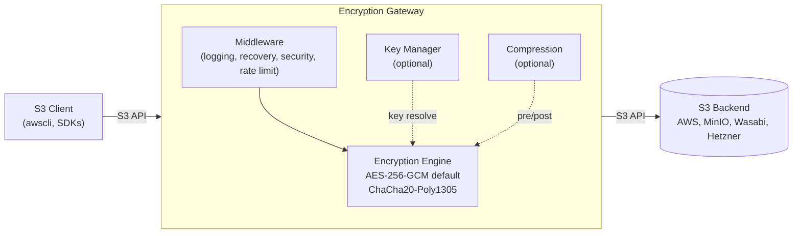

# S3 Encryption Gateway


[](LICENSE)
[](https://artifacthub.io/packages/search?repo=s3-encryption-gateway)

## The Problem

Countless applications write data to S3-compatible storage — database backups, log archives, ML training data, CI/CD artifacts — but most of them don't encrypt that data client-side.

Server-side encryption (SSE) only protects data at rest on the provider's disks. The storage provider still holds the keys and can technically access your data. For regulated industries, shared infrastructure, or zero-trust architectures, that's not enough.

Modifying every application to implement client-side encryption isn't realistic. Different tools use different S3 SDKs, different languages, and different upload strategies. Some are closed-source. Some are operators you don't control.

**The result:** sensitive data sits on object storage, encrypted only by keys the storage provider controls — or not encrypted at all.

## The Solution

The S3 Encryption Gateway is a transparent HTTP proxy that sits between your applications and any S3-compatible storage backend. It encrypts data on the way in and decrypts it on the way out — without changing a single line of application code.

```
┌─────────────┐          ┌──────────────────────┐          ┌─────────────────┐
│  S3 Client  │──S3 API──▶  Encryption Gateway │──S3 API──▶  S3 Backend    │
│  (any app) ◀──────────│  encrypt/decrypt    ◀──────────│  (AWS, MinIO,   │
└─────────────┘  plain   └──────────────────────┘  cipher  │   Hetzner, ...) │
                 text                               text   └─────────────────┘
```

- **Transparent**: Point your S3 endpoint URL at the gateway — that's it
- **AES-256-GCM or ChaCha20-Poly1305**: Authenticated encryption with per-object keys
- **Full S3 API compatibility**: PUT, GET, HEAD, DELETE, List, multipart uploads, range requests
- **Multi-provider**: Works with AWS S3, MinIO, Wasabi, Hetzner, Ceph, Cloudflare R2, and more
- **Production features**: Prometheus metrics, health checks, TLS, rate limiting, compression
- **KMS integration**: Envelope encryption with Cosmian KMIP (AWS KMS and Vault Transit planned)
- **Streaming**: Chunked encryption for large files with optimized range request handling

## Who Needs This?

| Category | Examples | What they store | Encrypts itself? |
|---|---|---|---|
| **Databases** | CNPG, Zalando Postgres, MySQL Operator | Backups, WAL archives | ❌ |
| **Backup tools** | Velero, Restic, Longhorn, Kasten | Cluster/app backups, snapshots | ⚠️ Varies |
| **Log & metrics** | Loki, Thanos, Mimir, Tempo, Cortex | Logs, metrics, traces | ❌ |
| **File sharing** | Nextcloud, Seafile, ownCloud | User files, documents, photos | ⚠️ Partial/complex |
| **Data platforms** | Spark, Trino, Iceberg, Delta Lake | Analytics data, query results | ❌ |
| **ML platforms** | MLflow, Kubeflow, DVC, JupyterHub | Models, training data, experiments | ❌ |
| **CI/CD & Git** | GitLab, Gitea, Forgejo, Jenkins | Artifacts, LFS, packages | ⚠️ Varies |
| **Chat & social** | Mattermost, Mastodon | Uploads, media, attachments | ❌ |
| **IaC state** | Terraform, OpenTofu, Pulumi | State files (often containing secrets!) | ⚠️ Often forgotten |
| **Container registries** | Harbor, GitLab Registry | Image layers, blobs | ❌ |
| **Custom apps** | Any S3 client | Whatever you store | ⚠️ Your responsibility |

If your compliance team, CISO, or data protection officer asks *"Are our S3 objects encrypted client-side?"* — and the honest answer is *"not all of them"* — this gateway fixes that in one place, for all applications at once.

## Born from Production

We built this gateway because we needed it ourselves. We run cloud platforms for customers and use CloudNativePG as our PostgreSQL operator on Kubernetes. CNPG handles automated backups, WAL archiving, and point-in-time recovery — but it writes those database dumps to S3 unencrypted.

Full database backups in plaintext on object storage wasn't acceptable. But modifying every application that writes to S3 wasn't practical either — the problem wasn't limited to CNPG.

So we built a transparent proxy that solves the problem once, for every application, without touching a single line of application code. The S3 Encryption Gateway is running in production, protecting data across multiple environments and storage backends.

## Quick Start

### Prerequisites

- Docker (recommended), or
- Go 1.22+ for local builds

### Docker (Simplest)

```bash
docker run -p 8080:8080 \
  -e BACKEND_ENDPOINT="https://s3.amazonaws.com" \
  -e BACKEND_REGION="us-east-1" \
  -e BACKEND_ACCESS_KEY="your-key" \
  -e BACKEND_SECRET_KEY="your-secret" \
  -e ENCRYPTION_PASSWORD="your-password" \
  s3-encryption-gateway:latest
```

Now point any S3 client at the gateway instead of directly at S3:

```bash
# Before: direct to S3 (unencrypted)
aws s3 cp backup.sql s3://my-bucket/ --endpoint-url https://s3.amazonaws.com

# After: through the gateway (encrypted)
aws s3 cp backup.sql s3://my-bucket/ --endpoint-url http://localhost:8080
```

That's it. Your data is now encrypted client-side before it reaches the storage backend.

### Kubernetes (Helm)

```bash
kubectl create secret generic s3-encryption-gateway-secrets \
  --from-literal=backend-access-key=YOUR_KEY \
  --from-literal=backend-secret-key=YOUR_SECRET \
  --from-literal=encryption-password=YOUR_PASSWORD

helm install s3-encryption-gateway ./helm/s3-encryption-gateway
```

See the [Helm chart documentation](helm/s3-encryption-gateway/README.md) for detailed deployment options.

### Docker Compose

For local development and testing with a bundled MinIO backend:

```bash
cp docker/docker-compose.example.yml docker-compose.yml
cp docker/docker-compose.env.example .env
nano .env  # Edit with your configuration
docker-compose up -d
```

See [Docker Deployment](#docker-deployment) below for full details.

### Building from Source

```bash
# Build the binary
make build

# Or build directly
go build -o bin/s3-encryption-gateway ./cmd/server

# Run
./bin/s3-encryption-gateway
```

## Configuration

Create a `config.yaml` file (see `config.yaml.example` for reference):

```yaml
listen_addr: ":8080"
log_level: "info"

backend:
  endpoint: "https://s3.amazonaws.com"
  region: "us-east-1"
  access_key: "YOUR_ACCESS_KEY"
  secret_key: "YOUR_SECRET_KEY"
  provider: "aws"
  use_path_style: false  # set true for some S3-compatible providers

encryption:
  password: "YOUR_ENCRYPTION_PASSWORD"
  preferred_algorithm: "AES256-GCM"   # or "ChaCha20-Poly1305"
  supported_algorithms:
    - "AES256-GCM"
    - "ChaCha20-Poly1305"

compression:
  enabled: false
  min_size: 1024
  content_types: ["text/", "application/json", "application/xml"]
  algorithm: "gzip"
  level: 6

rate_limit:
  enabled: false
  limit: 100
  window: "60s"

cache:
  enabled: false
  max_size: 104857600     # 100MB
  max_items: 1000
  default_ttl: "5m"

audit:
  enabled: false
  max_events: 10000
  sink:
    type: "stdout"      # stdout, file, or http
    file_path: ""       # if type=file
    endpoint: ""        # if type=http
    batch_size: 100
    flush_interval: "5s"
```

Or use environment variables:

```bash
export LISTEN_ADDR=":8080"
export BACKEND_ENDPOINT="https://s3.amazonaws.com"
export BACKEND_REGION="us-east-1"
export BACKEND_ACCESS_KEY="your-access-key"
export BACKEND_SECRET_KEY="your-secret-key"
export BACKEND_USE_PATH_STYLE=false
export ENCRYPTION_PASSWORD="your-encryption-password"
# Optional algorithm configuration
export ENCRYPTION_PREFERRED_ALGORITHM="AES256-GCM"   # or "ChaCha20-Poly1305"
export ENCRYPTION_SUPPORTED_ALGORITHMS="AES256-GCM,ChaCha20-Poly1305"
# Compression
export COMPRESSION_ENABLED=false
export COMPRESSION_MIN_SIZE=1024
export COMPRESSION_CONTENT_TYPES="text/,application/json,application/xml"
export COMPRESSION_ALGORITHM=gzip
export COMPRESSION_LEVEL=6
# Rate limiting
export RATE_LIMIT_ENABLED=false
export RATE_LIMIT_REQUESTS=100
export RATE_LIMIT_WINDOW="60s"
# Cache
export CACHE_ENABLED=false
export CACHE_MAX_SIZE=104857600
export CACHE_MAX_ITEMS=1000
export CACHE_DEFAULT_TTL="5m"
# Audit
export AUDIT_ENABLED=false
export AUDIT_MAX_EVENTS=10000
export AUDIT_SINK_TYPE="stdout"
export AUDIT_SINK_FILE_PATH="/var/log/s3-gateway/audit.json" # if type=file
export AUDIT_SINK_ENDPOINT="http://log-collector:8080"       # if type=http
export AUDIT_SINK_BATCH_SIZE=100
export AUDIT_SINK_FLUSH_INTERVAL="5s"
```

### Running

```bash
# Run locally
make run

# Or run directly
./bin/s3-encryption-gateway
```

## Docker Deployment

### Build Docker Image

```bash
make docker-build
```

### Docker Compose

For local development and testing, use the provided Docker Compose setup:

```bash
# Copy the example configuration
cp docker-compose.example.yml docker-compose.yml
cp docker-compose.env.example .env

# Edit .env with your configuration
nano .env

# Start the services
docker-compose up -d

# View logs
docker-compose logs -f gateway
```

**Services included:**
- **MinIO**: S3-compatible backend storage for development/testing
- **S3 Encryption Gateway**: The encryption proxy running on port 8080

**Configuration:**
- Edit `.env` to customize backend, encryption, and other settings
- The gateway automatically connects to MinIO backend
- Access MinIO Console at http://localhost:9001
- Gateway API available at http://localhost:8080

**Example .env configuration:**
```bash
# Required: Set a secure encryption password
ENCRYPTION_PASSWORD=your-secure-password-here

# Optional: Configure backend (defaults to local MinIO)
BACKEND_ENDPOINT=http://localhost:9000
BACKEND_ACCESS_KEY=minioadmin
BACKEND_SECRET_KEY=minioadmin123

# Optional: Enable features
COMPRESSION_ENABLED=true
CACHE_ENABLED=true
```

## Use Cases

### Database Backup Encryption

CloudNativePG, Zalando Postgres Operator, and similar database operators write backups directly to S3. Point the backup endpoint at the gateway:

```yaml
# CloudNativePG Cluster example
apiVersion: postgresql.cnpg.io/v1
kind: Cluster
spec:
  backup:
    barmanObjectStore:
      endpointURL: "http://s3-encryption-gateway:8080"
      destinationPath: "s3://database-backups/"
      s3Credentials:
        accessKeyId:
          name: s3-creds
          key: ACCESS_KEY
        secretAccessKey:
          name: s3-creds
          key: SECRET_KEY
```

### Kubernetes Backup Encryption

Velero and similar backup tools can route through the gateway by configuring the S3 endpoint:

```yaml
# Velero BackupStorageLocation example
apiVersion: velero.io/v1
kind: BackupStorageLocation
spec:
  provider: aws
  objectStorage:
    bucket: velero-backups
  config:
    s3Url: "http://s3-encryption-gateway:8080"
    region: us-east-1
```

### Log Data Protection

Log aggregators like Loki store potentially PII-containing log data on S3. Route through the gateway to encrypt at rest:

```yaml
# Loki S3 storage config example
storage_config:
  aws:
    s3: s3://access-key:secret-key@s3-encryption-gateway:8080/loki-logs
    s3forcepathstyle: true
```

### Compliance & Data Sovereignty

The gateway helps satisfy encryption requirements across multiple compliance frameworks:

- **ISO 27001** (A.10.1.1) — Cryptographic controls for data protection
- **BSI C5 / IT-Grundschutz** — Client-side encryption with customer-managed keys
- **GDPR Art. 32** — Technical measures for data protection (encryption at rest)
- **PCI DSS Req. 3** — Protect stored cardholder data

## External Key Manager (KMS) - Cosmian KMIP

The gateway supports external Key Management Systems (KMS) for envelope encryption with key rotation support. Currently, **Cosmian KMIP** is fully implemented and tested.

### Quick Start with Cosmian KMS

1. **Start Cosmian KMS** (using Docker for local testing):

```bash
docker run -d --rm --name cosmian-kms \
  -p 5696:5696 -p 9998:9998 --entrypoint cosmian_kms \
  ghcr.io/cosmian/kms:5.14.1
```

2. **Create a wrapping key** via the Cosmian KMS UI (http://localhost:9998/ui) and note the key ID.

3. **Configure the gateway** to use Cosmian KMS:

```yaml
encryption:
  password: "fallback-password-123456"  # Used for pre-existing objects encrypted with password
  key_manager:
    enabled: true
    provider: "cosmian"
    dual_read_window: 1  # Allow reading with previous 1 key version during rotation
    cosmian:
      # RECOMMENDED: JSON/HTTP endpoint (tested and verified in CI)
      # Full URL format (recommended for clarity):
      endpoint: "http://localhost:9998/kmip/2_1"
      # Base URL format (also works - path /kmip/2_1 is auto-appended):
      # endpoint: "http://localhost:9998"
      # ADVANCED: Binary KMIP endpoint (requires proper TLS/client certificates)
      # endpoint: "localhost:5696"  # Requires ca_cert, client_cert, client_key
      timeout: "10s"
      keys:
        - id: "your-key-id-from-cosmian"  # Replace with actual key ID from Cosmian KMS UI
          version: 1
      # TLS configuration (required for HTTPS or binary KMIP in production)
      # For HTTP (testing): TLS not required
      # For HTTPS (production): ca_cert required
      # For binary KMIP: ca_cert, client_cert, client_key all required
      # ca_cert: "/path/to/ca.pem"
      # client_cert: "/path/to/client.crt"
      # client_key: "/path/to/client.key"
      # insecure_skip_verify: false  # Only for testing (not recommended)
```

Or via environment variables:

```bash
export KEY_MANAGER_ENABLED=true
export KEY_MANAGER_PROVIDER=cosmian
export KEY_MANAGER_DUAL_READ_WINDOW=1
# RECOMMENDED: JSON/HTTP endpoint (tested and verified)
# Full URL format (recommended):
export COSMIAN_KMS_ENDPOINT=http://localhost:9998/kmip/2_1
# Base URL format (also works - path /kmip/2_1 is auto-appended):
# export COSMIAN_KMS_ENDPOINT=http://localhost:9998
# ADVANCED: Binary KMIP (requires TLS certificates)
# export COSMIAN_KMS_ENDPOINT=localhost:5696
export COSMIAN_KMS_TIMEOUT=10s
export COSMIAN_KMS_KEYS="your-key-id:1"  # Format: "key1:version1,key2:version2"
```

### How It Works

- **Envelope Encryption**: The gateway generates a unique Data Encryption Key (DEK) for each object, then wraps it with the KMS master key
- **Key Rotation**: The `dual_read_window` setting allows reading objects encrypted with previous key versions during rotation
- **Fallback Support**: Objects encrypted with the password (before KMS was enabled) can still be decrypted
- **Health Checks**: KMS health is automatically checked via the `/ready` endpoint

### Protocol Options

**JSON/HTTP (Recommended - Tested)**:
- Endpoint format (full URL, recommended): `http://localhost:9998/kmip/2_1` or `https://kms.example.com/kmip/2_1`
- Endpoint format (base URL, also works): `http://localhost:9998` (path `/kmip/2_1` is automatically appended)
- No TLS client certificates required for HTTP (testing)
- TLS certificates required for HTTPS (production: `ca_cert` recommended)
- Fully tested and verified in CI

**Binary KMIP (Advanced - Requires TLS)**:
- Endpoint format: `localhost:5696` or `kms.example.com:5696`
- Requires proper TLS configuration: `ca_cert`, `client_cert`, and `client_key`
- Not fully tested in CI - use with caution
- Suitable for production deployments with proper certificate management

### Production Deployment

For production deployments:
- **JSON/HTTP with HTTPS**: Use `https://kms.example.com/kmip/2_1` with `ca_cert` for server verification
- **Binary KMIP**: Requires full TLS setup (`ca_cert`, `client_cert`, `client_key`) for mutual TLS
- Set `insecure_skip_verify: false` (or omit it)
- Configure multiple keys for rotation: `[{id: "key-v1", version: 1}, {id: "key-v2", version: 2}]`

See [`docs/KMS_COMPATIBILITY.md`](docs/KMS_COMPATIBILITY.md) for detailed documentation and implementation status. AWS KMS and Vault Transit adapters are planned for v1.0.

## Architecture



### Data Flow (PUT/GET)


## Kubernetes Deployment

The gateway includes Helm charts for easy Kubernetes deployment. See the [Helm chart documentation](helm/s3-encryption-gateway/README.md) for detailed deployment instructions.

### Quick Deploy

1. Create secrets:

```bash
kubectl create secret generic s3-encryption-gateway-secrets \
  --from-literal=backend-access-key=YOUR_KEY \
  --from-literal=backend-secret-key=YOUR_SECRET \
  --from-literal=encryption-password=YOUR_PASSWORD
```

2. Deploy using Helm:

```bash
helm install s3-encryption-gateway ./helm/s3-encryption-gateway
```

Or apply manifests directly:

```bash
kubectl apply -f k8s/
```

## API Usage

The gateway is fully compatible with the S3 API. Use any S3 client or SDK:

### Using AWS CLI

```bash
# Configure endpoint
aws configure set s3.endpoint_url http://localhost:8080

# Upload file
aws s3 cp file.txt s3://my-bucket/my-key

# Download file
aws s3 cp s3://my-bucket/my-key file.txt

# List objects
aws s3 ls s3://my-bucket/ --endpoint-url http://localhost:8080
```

### Using curl

```bash
# Upload object
curl -X PUT http://localhost:8080/my-bucket/my-key \
  -H "Content-Type: text/plain" \
  --data "Hello, World!"

# Download object
curl http://localhost:8080/my-bucket/my-key

# Delete object
curl -X DELETE http://localhost:8080/my-bucket/my-key

# List objects
curl "http://localhost:8080/my-bucket?prefix=test"
```

### Supported Operations

- **Core Operations**: PUT, GET, HEAD, DELETE, List Objects
- **Advanced Features**: Multipart uploads, range requests, presigned URLs
- **Compatibility**: Works with all standard S3 clients and SDKs

## Monitoring & Observability

### Health Checks

The gateway provides health check endpoints:

- `/health` - General health status
- `/ready` - Readiness probe (for Kubernetes)
- `/live` - Liveness probe (for Kubernetes)
- `/metrics` - Prometheus metrics

### Metrics

Comprehensive Prometheus metrics are exported with reduced label cardinality:

- **HTTP Metrics**: Request counts, durations, bytes transferred
- **S3 Operations**: Operation counts, durations, error rates
- **Encryption**: Encryption/decryption counts, durations, throughput
- **System Metrics**: Active connections, goroutines, memory usage

Key metrics:
- `http_requests_total` - Total HTTP requests
- `encryption_operations_total` - Total encryption operations
- `active_connections` - Current active connections
- `goroutines_total` - Number of goroutines
- `memory_alloc_bytes` - Memory allocated

## Security Features

### TLS/HTTPS Support

The gateway supports TLS/HTTPS encryption. Enable it in configuration:

```yaml
tls:
  enabled: true
  cert_file: /path/to/cert.pem
  key_file: /path/to/key.pem
```

Or via environment variables:
```bash
export TLS_ENABLED=true
export TLS_CERT_FILE=/path/to/cert.pem
export TLS_KEY_FILE=/path/to/key.pem
```

### Security Headers
The gateway automatically sets security headers on all responses:
- `X-Frame-Options: DENY`
- `X-Content-Type-Options: nosniff`
- `X-XSS-Protection: 1; mode=block`
- `Strict-Transport-Security` (for TLS connections)
- `Content-Security-Policy: default-src 'self'`
- `Referrer-Policy: strict-origin-when-cross-origin`

### Rate Limiting
Rate limiting can be enabled to protect against abuse:

```yaml
rate_limit:
  enabled: true
  limit: 100      # Requests per window
  window: "60s"   # Time window
```

## Security Considerations

- **Encryption Password**: Store encryption passwords securely using secrets management (Kubernetes Secrets, HashiCorp Vault, etc.)
- **Backend Credentials**: Use IAM roles, service accounts, or secure credential storage systems
- **Network Security**: Deploy behind TLS termination (e.g., Kubernetes Ingress) or enable built-in TLS
- **Access Control**: Restrict gateway access to authorized clients using network policies, firewalls, or API gateways
- **Rate Limiting**: Enable rate limiting in production environments to prevent abuse and ensure fair resource usage

### Multipart Upload Encryption

**⚠️ Important Security Notice**: Multipart uploads are **not encrypted** by the S3 Encryption Gateway due to fundamental architectural limitations.

- **Why not encrypted**: S3 concatenates multipart upload parts server-side. Encrypting each part individually creates multiple invalid encrypted streams when combined.
- **Security impact**: Data uploaded via multipart operations is stored unencrypted on the S3 backend.
- **Recommended alternatives**:
  - Use client-side encryption before sending data to the gateway
  - Encrypt files at the application level before upload
  - Use single-part uploads for sensitive data
  - Consider using a different encryption strategy for large files

For encrypted multipart uploads, implement encryption in your application or S3 client before sending data to the gateway.

### Large File Handling

For files larger than S3 object size limits (AWS S3: 5TB, other providers vary):

- **Split objects are encrypted correctly**: When large files are split into multiple objects by the client, each object is encrypted individually
- **Naming convention**: Use client-side splitting with naming like `file.part1`, `file.part2`, etc.
- **Encryption consistency**: Each split object gets its own encryption parameters (salt, IV) but maintains the same security guarantees
- **Multipart within splits**: If individual split objects still require multipart uploads, those parts are not encrypted (same limitation as above)

### Disabling Multipart Uploads

For maximum security, you can disable multipart uploads entirely:

```yaml
server:
  disable_multipart_uploads: true  # Set via SERVER_DISABLE_MULTIPART_UPLOADS env var
```

**When enabled:**
- ✅ **All uploads are encrypted** (no unencrypted multipart data)
- ❌ **Multipart uploads are rejected** with HTTP 501 Not Implemented
- ✅ **Single-part uploads work normally**
- ⚠️ **Large files must be split** into multiple single-part objects

This is a security vs. compatibility trade-off. Most S3 clients support single-part uploads for large files through automatic splitting.

### Encryption Details

- **Algorithm**: AES-256-GCM (default) or ChaCha20-Poly1305
- **Key Derivation**: PBKDF2 with 100,000+ iterations
- **Encryption Mode**: Chunked encryption with per-chunk IVs for streaming support
- **Range Requests**: Highly optimized - fetches only needed encrypted chunks (99.9%+ reduction in transfer/decryption)
- **Multipart Limitation**: Multipart uploads bypass encryption due to S3 concatenation behavior

## Compatible Backends

The gateway works with any S3-compatible storage service. Tested and compatible backends:

| Backend | Status | Notes |
|---|---|---|
| AWS S3 | Tested | Full compatibility |
| MinIO | Tested | Primary development backend |
| Hetzner Object Storage | Tested | Production use |
| Wasabi | Tested | Full compatibility |
| Ceph RGW | Compatible | S3-compatible mode |
| Cloudflare R2 | Compatible | S3-compatible API |
| DigitalOcean Spaces | Compatible | S3-compatible API |
| Backblaze B2 | Compatible | S3-compatible API |

Using a backend not listed here? The gateway works with any service that implements the S3 API. [Open an issue](https://github.com/kenchrcum/s3-encryption-gateway/issues) to let us know about your experience.

## Roadmap

### v1.0

- **AWS KMS adapter** — native envelope encryption with AWS-managed keys
- **HashiCorp Vault Transit** — key management via Vault's Transit secrets engine
- **Structured audit logging** — compliance-ready audit trails with configurable sinks
- **Multipart encryption** — encrypted multipart uploads (currently unencrypted due to S3 concatenation constraints)

### Future

- Azure Key Vault and GCP Cloud KMS adapters
- Per-bucket encryption policies
- S3 Encryption Gateway Kubernetes Operator
- Multi-arch images with SBOM and SLSA provenance

See [`docs/ROADMAP.md`](docs/ROADMAP.md) for the complete roadmap.

## Contributing

We welcome contributions! Please see [`docs/DEVELOPMENT_GUIDE.md`](docs/DEVELOPMENT_GUIDE.md) for development setup and guidelines.

### Areas Where We'd Love Help

- **Additional KMS adapters** — AWS KMS, Vault Transit, Azure Key Vault, GCP Cloud KMS
- **Backend testing** — testing with more S3-compatible storage providers
- **Multipart encryption** — research and implementation of encrypted multipart uploads
- **Documentation** — guides, tutorials, and integration examples
- **Performance benchmarks** — throughput and latency measurements across providers

### Getting Started

1. Fork the repository
2. Create a feature branch
3. Make your changes
4. Run tests and linter (`make test && make lint`)
5. Submit a pull request

## License

MIT License - see [LICENSE](LICENSE) file for details.

## Support

- **Issues**: Report bugs or request features on [GitHub Issues](https://github.com/kenchrcum/s3-encryption-gateway/issues)
- **Documentation**: See the [`docs/`](docs/) directory for detailed guides
