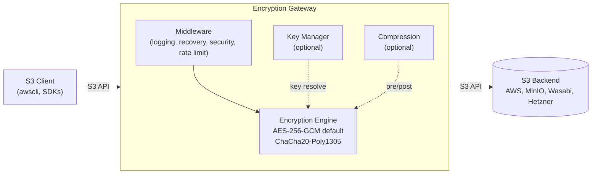
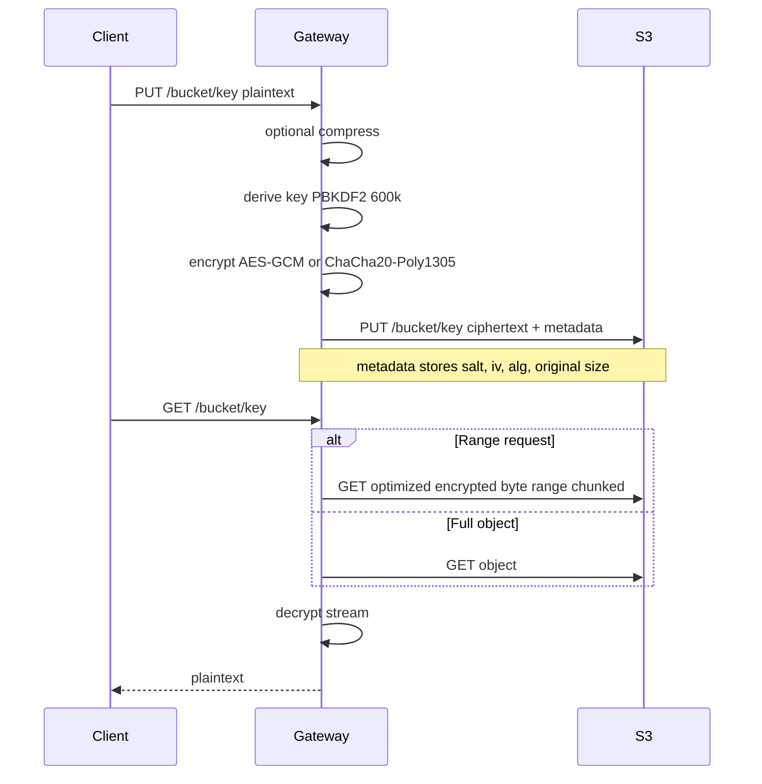

# S3 Encryption Gateway


[](LICENSE)
[](https://artifacthub.io/packages/search?repo=s3-encryption-gateway)

## The Problem

Countless applications write data to S3-compatible storage — database backups, log archives, ML training data, CI/CD artifacts — but most of them don't encrypt that data client-side.

**The real threat isn't a rogue storage provider.** Most people reasonably trust their cloud provider and their server-side encryption (SSE). The much more common and practical risk is a **misconfigured IAM policy, overly broad bucket policy, accidentally public ACL, or compromised access key**. Any mistake at the IAM or policy layer directly exposes your plaintext data — because without client-side encryption, whoever can reach the bucket can read everything in it.

By adding a cryptographic layer at the gateway, a configuration mistake in your cloud account no longer immediately translates into a data breach. An attacker who gains unauthorized S3 access — through a policy misconfiguration, a leaked key, or any other account-level compromise — only retrieves ciphertext. TheyThey would also need to compromise the gateway — which in a typical deployment never leaves your private network.

This is defense-in-depth for object storage: your cloud account's access controls remain your first line of defense; client-side encryption is the second — and it holds even when the first fails.

Beyond misconfiguration risk, there are valid reasons to want an independent crypto layer: regulated environments that require customer-managed keys, multi-tenant shared infrastructure, or simply a preference for not relying solely on provider controls.

Modifying every application to implement client-side encryption isn't realistic. Different tools use different S3 SDKs, different languages, and different upload strategies. Some are closed-source. Some are operators you don't control.

**The result:** sensitive data sits on object storage, protected only by IAM policies and SSE keys the provider controls — one misconfiguration away from full exposure.

## The Solution

The S3 Encryption Gateway is a transparent HTTP proxy that sits between your applications and any S3-compatible storage backend. It encrypts data on the way in and decrypts it on the way out — without changing a single line of application code.

```
┌─────────────┐          ┌──────────────────────┐          ┌─────────────────┐
│  S3 Client  │──S3 API──▶  Encryption Gateway │──S3 API──▶  S3 Backend    │
│  (any app) ◀──────────│  encrypt/decrypt    ◀──────────│  (AWS, MinIO,   │
└─────────────┘  plain   └──────────────────────┘  cipher  │   Hetzner, ...) │
                 text                               text   └─────────────────┘
```

**Transparent**: Point your S3 endpoint URL at the gateway — that's it. No application changes required.

## Who Needs This?

| Category | Examples | What they store | Encrypts itself? |
|---|---|---|---|
| **Databases** | CNPG, Zalando Postgres, MySQL Operator | Backups, WAL archives | ❌ |
| **Backup tools** | Velero, Restic, Longhorn, Kasten | Cluster/app backups, snapshots | ⚠️ Varies |
| **Log & metrics** | Loki, Thanos, Mimir, Tempo, Cortex | Logs, metrics, traces | ❌ |
| **File sharing** | Nextcloud, Seafile, ownCloud | User files, documents, photos | ⚠️ Partial/complex |
| **Data platforms** | Spark, Trino, Iceberg, Delta Lake | Analytics data, query results | ❌ |
| **ML platforms** | MLflow, Kubeflow, DVC, JupyterHub | Models, training data, experiments | ❌ |
| **CI/CD & Git** | GitLab, Gitea, Forgejo, Jenkins | Artifacts, LFS, packages | ⚠️ Varies |
| **Chat & social** | Mattermost, Mastodon | Uploads, media, attachments | ❌ |
| **IaC state** | Terraform, OpenTofu, Pulumi | State files (often containing secrets!) | ⚠️ Often forgotten |
| **Container registries** | Harbor, GitLab Registry | Image layers, blobs | ❌ |
| **Custom apps** | Any S3 client | Whatever you store | ⚠️ Your responsibility |

If your compliance team, CISO, or data protection officer asks *"Are our S3 objects encrypted client-side?"* — and the honest answer is *"not all of them"* — this gateway fixes that in one place, for all applications at once.

## Born from Production

We built this gateway because we needed it ourselves. We run cloud platforms for customers and use CloudNativePG as our PostgreSQL operator on Kubernetes. CNPG handles automated backups, WAL archiving, and point-in-time recovery — but it writes those database dumps to S3 unencrypted.

Full database backups in plaintext on object storage wasn't acceptable. But modifying every application that writes to S3 wasn't practical either — the problem wasn't limited to CNPG.

So we built a transparent proxy that solves the problem once, for every application, without touching a single line of application code. The S3 Encryption Gateway is running in production, protecting data across multiple environments and storage backends.

---

## Features

### Object Encryption

All objects are encrypted before being sent to the backend and decrypted on retrieval. Encryption is transparent — any S3 client works without modification.

- **AES-256-GCM** (default) or **ChaCha20-Poly1305**: Authenticated encryption with per-object keys
- **Key derivation**: PBKDF2-HMAC-SHA256 with 600,000+ iterations (configurable; default raised in v0.8 per NIST SP 800-132)
- **Chunked streaming**: Large files are encrypted in chunks with per-chunk IVs, enabling efficient range requests
- **Range requests**: Fetches only the encrypted chunks covering the requested plaintext byte range — 99.9%+ reduction in transferred bytes compared to fetching the full object
- **FIPS-compliant profile**: Build with `-tags=fips` to restrict to AES-256-GCM + HKDF-SHA256 + PBKDF2-HMAC-SHA256 (all FIPS-140 approved)

### Encrypted Multipart Uploads

Large objects uploaded via the S3 multipart API are encrypted end-to-end. Each upload gets its own key; each chunk gets a deterministic, collision-free IV derived via HKDF-SHA256.

- **Per-upload DEK**: Fresh 32-byte AES-256-GCM key generated at `CreateMultipartUpload`
- **DEK wrapping**: Via the configured `KeyManager` (Cosmian KMIP, HSM, or built-in password-based `PasswordKeyManager`)
- **Per-chunk IV**: `HKDF-Expand(SHA-256, dek, salt=sha256(uploadId), info=ivPrefix‖BE32(part)‖BE32(chunk))` — deterministic and collision-free
- **AEAD manifest**: Encrypted companion object at `<key>.mpu-manifest`; main object metadata carries a pointer
- **Ranged GET across part boundaries**: Precise byte-range fetch via `EncRangeForPlaintextRange`; only the chunks covering the requested plaintext range are fetched and decrypted
- **Tamper detection**: AES-GCM tag failure on any chunk returns 500 and emits an `mpu.tamper_detected` audit event; first-chunk tamper returns 500 before any body is written
- **State store**: Valkey (or any Redis-protocol-compatible store); 7-day TTL; one hash per active upload
- **FIPS**: AES-256-GCM + HKDF-SHA256 — both FIPS-140 approved (works under `-tags=fips`)
- **Opt-in per bucket** via policy; requires Valkey for in-flight state

See [ADR 0009](docs/adr/0009-encrypted-multipart-uploads.md) for the full design rationale.

#### Enabling encrypted multipart uploads

Encrypted multipart uploads require a **Valkey** (or Redis-protocol-compatible) instance for in-flight state storage. Enable per bucket via policy and configure the state store in the gateway config:

```yaml
# config.yaml
multipart_state:
  valkey:
    addr: "valkey.internal:6379"
    password_env: "VALKEY_PASSWORD"  # env var name (not the literal password)
    tls:
      enabled: true
      ca_file: "/etc/gateway/valkey-ca.pem"
      cert_file: "/etc/gateway/valkey-client.pem"
      key_file:  "/etc/gateway/valkey-client-key.pem"
    ttl_seconds: 604800  # 7 days — refreshed on every UploadPart
    pool_size: 16
```

```yaml
# policy/my-bucket.yaml
id: my-encrypted-bucket
buckets:
  - "my-important-bucket"
encrypt_multipart_uploads: true
```

All Valkey settings are also available as environment variables (`VALKEY_ADDR`, `VALKEY_TLS_ENABLED`, `VALKEY_TLS_CA_FILE`, `VALKEY_TTL_SECONDS`, etc.).

`encrypt_multipart_uploads` defaults to `true` as of v0.8. Buckets without a matching policy, or policies that omit the field, will use the encrypted multipart upload path automatically. Set `encrypt_multipart_uploads: false` explicitly in the policy to opt a specific bucket out.

#### Fail-closed guarantees

The gateway refuses to silently degrade security under any of these conditions:

| Situation | Behaviour |
|---|---|
| `encrypt_multipart_uploads: true` on any policy + Valkey address not configured at startup | Process exits with a `Fatal` log — **no silent fallback to plaintext** |
| Valkey reachable at startup but transient failure mid-upload | 503 ServiceUnavailable on the affected request; client retries are safe because the IV schedule is deterministic |
| `UploadPart` succeeds on backend but `AppendPart` to Valkey fails | 503 ServiceUnavailable; client retries overwrite the same part idempotently |
| Policy is flipped mid-upload | In-flight uploads use the `PolicySnapshot` captured at `CreateMultipartUpload`; the flip only affects new uploads |
| No `KeyManager` and an encrypted-MPU request arrives | 503 ServiceUnavailable with reason `"KeyManager not configured"` |
| Plaintext Valkey + production config (`insecure_allow_plaintext: false`) | Startup refuses; emits a `gateway_mpu_valkey_insecure=1` gauge if overridden |

The dedicated escape hatch for deployments that cannot run Valkey at all:

```yaml
server:
  disable_multipart_uploads: true  # env: SERVER_DISABLE_MULTIPART_UPLOADS
```

This enforces a 5 GiB single-PUT ceiling but guarantees all data is encrypted and requires no state infrastructure.

#### UploadPart memory cap (`server.max_part_buffer`)

Each `UploadPart` request is buffered into a seekable in-memory buffer so the AWS SDK V2 SigV4 signer can re-read the body for payload hashing and retries. The default cap is **64 MiB** — parts larger than this are refused with HTTP 413 before any backend write occurs:

```yaml
server:
  max_part_buffer: 67108864  # 64 MiB (default); env: SERVER_MAX_PART_BUFFER
```

Raise this value if your workload uploads parts larger than 64 MiB. The cap applies to both encrypted and plaintext multipart upload paths. `Server.MaxLegacyCopySourceBytes` (default 256 MiB, set via `server.max_legacy_copy_source_bytes` / `SERVER_MAX_LEGACY_COPY_SOURCE_BYTES`) separately bounds the allocation incurred when copying legacy (non-chunked) encrypted objects with `CopyObject` or `UploadPartCopy`.

#### Deploying Valkey with the Helm chart

The Helm chart bundles an optional Valkey subchart which is off by default:

```yaml
# values.yaml
valkey:
  enabled: true
  architecture: standalone  # or "cluster" for HA
  auth:
    enabled: false           # enable + mount a secret for production
```

When `valkey.enabled=true`, the deployment template auto-wires `VALKEY_ADDR` to the subchart's `<release>-valkey:6379` service. You can also point at an external Valkey cluster via the `config.multipartState.valkey` values stanza — the two paths are mutually exclusive.

> **Cost note for Wasabi / Glacier / S3 IA users:** The Valkey state store exists precisely to avoid writing state objects to S3 — which on backends with minimum-storage-duration policies (Wasabi: 90 days on Pay-Go; Glacier / Standard-IA / One Zone-IA: 30–180 days) would incur significant phantom-storage charges. Your *data* objects still land on whichever backend you choose; only the ephemeral per-upload state lives in Valkey.

### External Key Management (KMS)

The gateway supports external Key Management Systems for envelope encryption with key rotation support. Currently **Cosmian KMIP** is fully implemented and tested.

- **Envelope encryption**: A unique Data Encryption Key (DEK) is generated per object, then wrapped with the KMS master key
- **Key rotation**: The `dual_read_window` setting allows reading objects encrypted with previous key versions during rotation
- **Fallback support**: Objects encrypted with the password (before KMS was enabled) can still be decrypted
- **Health checks**: KMS health is automatically checked via the `/ready` endpoint

#### Quick start with Cosmian KMS

1. Start Cosmian KMS:

```bash
docker run -d --rm --name cosmian-kms \
  -p 5696:5696 -p 9998:9998 --entrypoint cosmian_kms \
  ghcr.io/cosmian/kms:5.14.1
```

2. Create a wrapping key via the Cosmian KMS UI (http://localhost:9998/ui) and note the key ID.

3. Configure the gateway:

```yaml
encryption:
  password: "fallback-password-123456"  # Used for pre-existing objects encrypted with password
  key_manager:
    enabled: true
    provider: "cosmian"
    dual_read_window: 1  # Allow reading with previous 1 key version during rotation
    cosmian:
      endpoint: "http://localhost:9998/kmip/2_1"
      timeout: "10s"
      keys:
        - id: "your-key-id-from-cosmian"
          version: 1
```

Or via environment variables:

```bash
export KEY_MANAGER_ENABLED=true
export KEY_MANAGER_PROVIDER=cosmian
export KEY_MANAGER_DUAL_READ_WINDOW=1
export COSMIAN_KMS_ENDPOINT=http://localhost:9998/kmip/2_1
export COSMIAN_KMS_TIMEOUT=10s
export COSMIAN_KMS_KEYS="your-key-id:1"  # Format: "key1:version1,key2:version2"
```

#### Protocol options

**JSON/HTTP (recommended, tested in CI)**:
- Full URL: `http://localhost:9998/kmip/2_1` or `https://kms.example.com/kmip/2_1`
- Base URL also works: `http://localhost:9998` (path `/kmip/2_1` is auto-appended)
- No client certificates required for HTTP; `ca_cert` recommended for HTTPS

**Binary KMIP (advanced, requires TLS)**:
- Endpoint format: `localhost:5696` or `kms.example.com:5696`
- Requires `ca_cert`, `client_cert`, and `client_key`
- Not fully tested in CI — use with caution

See [`docs/KMS_COMPATIBILITY.md`](docs/KMS_COMPATIBILITY.md) for detailed documentation. AWS KMS and Vault Transit adapters are on the roadmap (see Roadmap section below).

### Compression

Optional pre-encryption compression reduces storage costs and transfer times for compressible data.

```yaml
compression:
  enabled: false
  min_size: 1024
  content_types: ["text/", "application/json", "application/xml"]
  algorithm: "gzip"
  level: 6
```

### Rate Limiting

Token-bucket rate limiting protects against abuse.

```yaml
rate_limit:
  enabled: true
  limit: 100      # requests per window
  window: "60s"
```

### Caching

Optional in-memory response cache reduces backend traffic for frequently read objects.

```yaml
cache:
  enabled: false
  max_size: 104857600     # 100 MB
  max_items: 1000
  default_ttl: "5m"
```

### Audit Logging

Structured audit events for every S3 operation, with configurable sinks.

```yaml
audit:
  enabled: false
  max_events: 10000
  sink:
    type: "stdout"      # stdout, file, or http
    file_path: ""
    endpoint: ""
    batch_size: 100
    flush_interval: "5s"
```

Multipart-specific audit events: `mpu.create`, `mpu.part`, `mpu.complete`, `mpu.abort`, `mpu.tamper_detected`, `mpu.valkey_unavailable`.

### Monitoring & Observability

#### Health endpoints

- `GET /health` — general health status
- `GET /ready` (alias `/readyz`) — readiness probe with per-dependency status:

```json
{
  "status": "ready",
  "checks": {
    "kms":    "ok",
    "valkey": "ok"
  }
}
```

Returns HTTP 503 with `status: "not_ready"` if any configured dependency fails its health check.

- `GET /live` — liveness probe
- `GET /metrics` — Prometheus metrics

Metrics endpoint routing (in priority order):
1. **Dedicated metrics port** (`metrics.addr: ":9090"` / `METRICS_ADDR`) — recommended for Kubernetes; unauthenticated plain HTTP, restrict via `NetworkPolicy`
2. **Admin port fallback** — when `metrics.addr` is empty and admin is enabled, `/metrics` is served on the admin port (requires bearer auth)
3. **S3 port fallback** — when both `metrics.addr` is empty and admin is disabled, `/metrics` is served on the S3 data-plane port (legacy, no auth)

#### Prometheus metrics

- **HTTP**: request counts, durations, bytes transferred
- **S3 operations**: operation counts, durations, error rates
- **Encryption**: encryption/decryption counts, durations, throughput
- **System**: active connections, goroutines, memory usage

Key metric names: `http_requests_total`, `encryption_operations_total`, `active_connections`, `goroutines_total`, `memory_alloc_bytes`.

Seven metrics track the multipart-encryption hot path:

| Metric | Type | Labels | Emitted on |
|---|---|---|---|
| `gateway_mpu_encrypted_total` | counter | `result` | Every `CompleteMultipartUpload` on encrypted buckets |
| `gateway_mpu_parts_total` | counter | `result` | Every `UploadPart` on encrypted buckets |
| `gateway_mpu_state_store_ops_total` | counter | `op`, `result` | Every Valkey op |
| `gateway_mpu_state_store_latency_seconds` | histogram | `op` | Every Valkey op |
| `gateway_mpu_valkey_up` | gauge | — | Ready-check HealthCheck |
| `gateway_mpu_valkey_insecure` | gauge | — | Startup, if TLS is disabled |
| `gateway_mpu_manifest_bytes` | histogram | — | Every `CompleteMultipartUpload` |

### TLS

The gateway can terminate TLS directly.

```yaml
tls:
  enabled: true
  cert_file: /path/to/cert.pem
  key_file: /path/to/key.pem
```

All responses also include security headers: `X-Frame-Options`, `X-Content-Type-Options`, `Strict-Transport-Security`, `Content-Security-Policy`, and others.

### Admin API

Bearer-authenticated admin endpoints on a separate port:

| Endpoint | Purpose |
|---|---|
| `POST /admin/mpu/abort/{uploadId}` | Force-abort an in-flight upload and delete its Valkey state |
| `GET /admin/mpu/list` | List active uploads (bucket, key, creation time) |

---

## Quick Start

### Prerequisites

- Docker (recommended), or
- Go 1.25+ for local builds

### Docker (Simplest)

```bash
docker run -p 8080:8080 \
  -e BACKEND_ENDPOINT="https://s3.amazonaws.com" \
  -e BACKEND_REGION="us-east-1" \
  -e BACKEND_ACCESS_KEY="your-key" \
  -e BACKEND_SECRET_KEY="your-secret" \
  -e ENCRYPTION_PASSWORD="your-password" \
  -e GW_ACCESS_KEY_1="gateway-access-key" \
  -e GW_SECRET_KEY_1="gateway-secret-key" \
  s3-encryption-gateway:latest
```

> **Authentication is required.** As of v0.8, every request must include valid AWS Signature V4 or V2 credentials matching an entry in `auth.credentials`. Unauthenticated requests will receive `AccessDenied`.

Point any S3 client at the gateway instead of directly at S3:

```bash
# Before: direct to S3 (unencrypted)
aws s3 cp backup.sql s3://my-bucket/ --endpoint-url https://s3.amazonaws.com

# After: through the gateway (encrypted)
aws s3 cp backup.sql s3://my-bucket/ --endpoint-url http://localhost:8080
```

### Kubernetes (Helm)

```bash
kubectl create secret generic s3-encryption-gateway-secrets \
  --from-literal=backend-access-key=YOUR_KEY \
  --from-literal=backend-secret-key=YOUR_SECRET \
  --from-literal=encryption-password=YOUR_PASSWORD \
  --from-literal=gateway-access-key=YOUR_GATEWAY_ACCESS_KEY \
  --from-literal=gateway-secret-key=YOUR_GATEWAY_SECRET_KEY

helm install s3-encryption-gateway ./helm/s3-encryption-gateway
```

See the [Helm chart documentation](helm/s3-encryption-gateway/README.md) for detailed deployment options.

### Docker Compose

For local development and testing with a bundled MinIO backend:

```bash
cp docker/docker-compose.example.yml docker-compose.yml
cp docker/docker-compose.env.example .env
nano .env  # Edit with your configuration
docker-compose up -d
```

Access MinIO Console at http://localhost:9001. Gateway API at http://localhost:8080.

### Building from Source

```bash
make build
# or
go build -o bin/s3-encryption-gateway ./cmd/server
./bin/s3-encryption-gateway
```

---

## Configuration

Create a `config.yaml` file (see `config.yaml.example` for reference):

```yaml
listen_addr: ":8080"
log_level: "info"

auth:
  credentials:
    - access_key: "YOUR_GATEWAY_ACCESS_KEY"
      secret_key: "YOUR_GATEWAY_SECRET_KEY"
      # proxied_bucket: "optional-bucket-filter"

backend:
  endpoint: "https://s3.amazonaws.com"
  region: "us-east-1"
  access_key: "YOUR_ACCESS_KEY"
  secret_key: "YOUR_SECRET_KEY"
  provider: "aws"
  use_path_style: false  # set true for some S3-compatible providers

encryption:
  password: "YOUR_ENCRYPTION_PASSWORD"
  preferred_algorithm: "AES256-GCM"   # or "ChaCha20-Poly1305"
  supported_algorithms:
    - "AES256-GCM"
    - "ChaCha20-Poly1305"

compression:
  enabled: false
  min_size: 1024
  content_types: ["text/", "application/json", "application/xml"]
  algorithm: "gzip"
  level: 6

rate_limit:
  enabled: false
  limit: 100
  window: "60s"

cache:
  enabled: false
  max_size: 104857600     # 100MB
  max_items: 1000
  default_ttl: "5m"

audit:
  enabled: false
  max_events: 10000
  sink:
    type: "stdout"      # stdout, file, or http
    file_path: ""
    endpoint: ""
    batch_size: 100
    flush_interval: "5s"
```

Environment variables are also supported for every setting:

```bash
export LISTEN_ADDR=":8080"
export BACKEND_ENDPOINT="https://s3.amazonaws.com"
export BACKEND_REGION="us-east-1"
export BACKEND_ACCESS_KEY="your-access-key"
export BACKEND_SECRET_KEY="your-secret-key"
export BACKEND_USE_PATH_STYLE=false
export ENCRYPTION_PASSWORD="your-encryption-password"
export ENCRYPTION_PREFERRED_ALGORITHM="AES256-GCM"
export ENCRYPTION_SUPPORTED_ALGORITHMS="AES256-GCM,ChaCha20-Poly1305"
export COMPRESSION_ENABLED=false
export RATE_LIMIT_ENABLED=false
export CACHE_ENABLED=false
export AUDIT_ENABLED=false
export TLS_ENABLED=false
```

---

## Use Cases

### Database Backup Encryption

CloudNativePG, Zalando Postgres Operator, and similar database operators write backups directly to S3. Point the backup endpoint at the gateway:

```yaml
# CloudNativePG Cluster example
apiVersion: postgresql.cnpg.io/v1
kind: Cluster
spec:
  backup:
    barmanObjectStore:
      endpointURL: "http://s3-encryption-gateway:8080"
      destinationPath: "s3://database-backups/"
      s3Credentials:
        accessKeyId:
          name: s3-creds
          key: ACCESS_KEY
        secretAccessKey:
          name: s3-creds
          key: SECRET_KEY
```

### Kubernetes Backup Encryption

Velero and similar backup tools can route through the gateway by configuring the S3 endpoint:

```yaml
# Velero BackupStorageLocation example
apiVersion: velero.io/v1
kind: BackupStorageLocation
spec:
  provider: aws
  objectStorage:
    bucket: velero-backups
  config:
    s3Url: "http://s3-encryption-gateway:8080"
    region: us-east-1
```

### Log Data Protection

Log aggregators like Loki store potentially PII-containing log data on S3. Route through the gateway to encrypt at rest:

```yaml
# Loki S3 storage config example
storage_config:
  aws:
    s3: s3://access-key:secret-key@s3-encryption-gateway:8080/loki-logs
    s3forcepathstyle: true
```

### Compliance & Data Sovereignty

The gateway helps satisfy encryption requirements across multiple compliance frameworks:

- **ISO 27001** (A.10.1.1) — Cryptographic controls for data protection
- **BSI C5 / IT-Grundschutz** — Client-side encryption with customer-managed keys
- **GDPR Art. 32** — Technical measures for data protection (encryption at rest)
- **PCI DSS Req. 3** — Protect stored cardholder data

---

## Architecture



### Data Flow (PUT/GET)



---

## Compatible Backends

The gateway works with any S3-compatible storage service. Tested and compatible backends:

| Backend | Status | Notes |
|---|---|---|
| AWS S3 | Tested | Full compatibility |
| MinIO | Tested | Primary development backend |
| Hetzner Object Storage | Tested | Production use |
| Wasabi | Tested | Full compatibility |
| Ceph RGW | Compatible | S3-compatible mode |
| Cloudflare R2 | Compatible | S3-compatible API |
| DigitalOcean Spaces | Compatible | S3-compatible API |
| Backblaze B2 | Compatible | S3-compatible API |

Using a backend not listed here? [Open an issue](https://github.com/kenchrcum/s3-encryption-gateway/issues) to let us know about your experience.

---

## Security Considerations

- **Encryption password**: Store securely using a secrets manager (Kubernetes Secrets, HashiCorp Vault, etc.)
- **Backend credentials**: Use IAM roles, service accounts, or secure credential storage
- **Network security**: Deploy behind TLS termination or enable built-in TLS
- **Access control**: Restrict gateway access using network policies, firewalls, or API gateways
- **Rate limiting**: Enable in production to prevent abuse

---

## Roadmap

### v1.0

- **AWS KMS adapter** — native envelope encryption with AWS-managed keys
- **HashiCorp Vault Transit** — key management via Vault's Transit secrets engine

### Shipped in v0.8 (current release)

- **Gateway-managed credential store** (V1.0-AUTH-1) — every request validated via SigV4/V2 against a gateway-local credential store; `use_client_credentials` passthrough removed; credentials configured via `auth.credentials` in config or env vars
- **Full security audit hardening** — 23 defence-in-depth findings resolved: `context.Context` propagation through the encryption engine, length-prefixed AAD canonicalization, `keyResolver` oracle removal, PBKDF2 default raised to 600 000 iterations, decompression bomb protection, presigned URL expiry cap (7 days), rate limiter map cap, admin token zeroization on shutdown, TLS config for audit HTTP sink, policy reload wired into config watcher, and more
- **Dedicated metrics port** — `/metrics` is no longer served on the public S3 port. A dedicated unauthenticated listener can be configured via `metrics.addr` / `METRICS_ADDR`; when not set, metrics fall back to the admin port (if enabled) or the S3 port (legacy). The Helm chart wires this end-to-end via `metrics.port` including Service, ServiceMonitor, PodMonitor, and NetworkPolicy (V1.0-SEC-L01)
- **XML injection fix** — `generateListObjectsXML` now uses proper `encoding/xml` marshaling
- **Docker healthcheck** — replaced `wget` healthcheck with a native Go binary; FIPS variant included

### Shipped in v0.7

- **Offline migration tool (`s3eg-migrate`)** — re-encrypts or re-seals existing objects in place for KDF-parameter migrations (V1.0-MAINT-1)
- **Configurable PBKDF2 iterations + per-object KDF metadata** (V1.0-SEC-H03) — iteration count recorded in object metadata; mixed-iteration deployments decrypt correctly
- **Large MPU streaming fixes** — `ReadTimeout` set to 0 (same as `WriteTimeout`) to prevent timeout kills on multi-hundred-MiB downloads; active write-deadline refresh during long streams; network errors distinguished from tamper on streaming (#135)
- **Constant-time credential comparison** — timing-safe comparison for all credential checks
- **V1.0-SEC-2 / V1.0-SEC-4 / V1.0-SEC-27 / V1.0-SEC-29** — additional hardening fixes

### Shipped in v0.6

- **Encrypted multipart uploads** — per-upload DEK, HKDF-derived per-chunk IVs, AEAD manifest, ranged GET across part boundaries, end-to-end tamper detection, Valkey state store, Helm subchart wiring (ADR 0009)
- **Pluggable KeyManager interface** (ADR 0004)
- **FIPS-compliant crypto profile** (ADR 0005, `-tags=fips`)
- **Multipart copy** (ADR 0006)
- **Admin API with key-rotation state machine** (ADR 0007)
- **Object Lock / Retention / Legal Hold pass-through** (ADR 0008)

### Future

- Azure Key Vault and GCP Cloud KMS adapters
- Per-bucket encryption policies
- S3 Encryption Gateway Kubernetes Operator
- Multi-arch images with SBOM and SLSA provenance

See [`docs/ROADMAP.md`](docs/ROADMAP.md) for the complete roadmap.

---

## Performance

Per-provider performance baselines and regression gates live in
[`docs/PERFORMANCE.md`](docs/PERFORMANCE.md). The nightly
`performance-baseline` workflow re-runs 19 micro-benchmarks plus per-provider
soak tests (MinIO, Garage, RustFS, SeaweedFS) and fails the job on
`> 15 %` throughput regressions or p99 latency growth.

## Test Coverage

The project enforces a **≥ 80% statement coverage gate** on every PR via
`make coverage-gate`. Nightly mutation testing (Gremlins) runs on the
critical non-crypto packages. See [`docs/COVERAGE.md`](docs/COVERAGE.md)
for the exclusion policy, regeneration guide, and mutation testing scope.

---

## Contributing

We welcome contributions! Please see [`docs/DEVELOPMENT_GUIDE.md`](docs/DEVELOPMENT_GUIDE.md) for development setup and guidelines.

### Areas Where We'd Love Help

- **Additional KMS adapters** — AWS KMS, Vault Transit, Azure Key Vault, GCP Cloud KMS
- **Backend testing** — testing with more S3-compatible storage providers
- **Interop matrix for encrypted multipart uploads** — verify AWS CLI, boto3, `aws-sdk-go-v2`, `minio-go` all round-trip correctly at 1 MiB / 8 MiB / 100 MiB / 500 MiB payload sizes against real backends
- **Zero-copy streaming encrypt/decrypt** — currently `UploadPart` buffers one part at a time via `io.ReadAll` (V0.6-PERF-1 follow-up)
- **Documentation** — guides, tutorials, and integration examples
- **Performance benchmarks** — throughput and latency measurements across providers

### Getting Started

1. Fork the repository
2. Create a feature branch
3. Make your changes
4. Run tests and linter (`make test && make lint`)
5. Submit a pull request

---

## License

MIT License — see [LICENSE](LICENSE) file for details.

## Support

- **Issues**: [GitHub Issues](https://github.com/kenchrcum/s3-encryption-gateway/issues)
- **Documentation**: [`docs/`](docs/) directory
